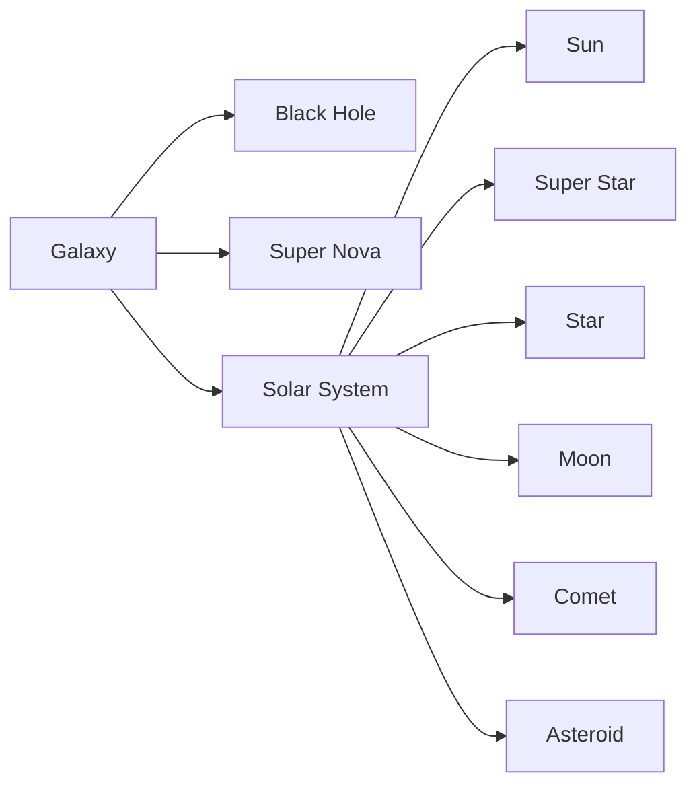

# BUF

GALAXY: A business galaxy covers an entire industry, defined by a NAICS Code. A galaxy is a vast network of interconnected companies, organizations, and stakeholders that operate in the same industry, offering similar products or services, and competing for the same customers.

BLACK HOLE: Large Corporation at the center of a galaxy which slowly consumes all its competitors The black hole is identified by the largest companies inside the NAICS Code. At the center of every galaxy is a massive black hole that exerts a powerful gravitational force on everything around it.

SUPER NOVA: A Corporate Cosmic-Shifting event A large event that can be felt across the entire industry.

SOLAR SYSTEM: Companies in a business galaxy are organized by their holding companies, known as the Solar System. These solar systems are classified based on their size, market share, and SIC Codes. 

SUN: The largest publicly visible company inside a solar system or the headquarters of an organization.

SUPER STAR: A flagship or role model company that could one day become a sun. This could also be a fast growing project that is gaining momentum. Super Stars usually require a vast amount of resources and a large budget, yet they also achieve

