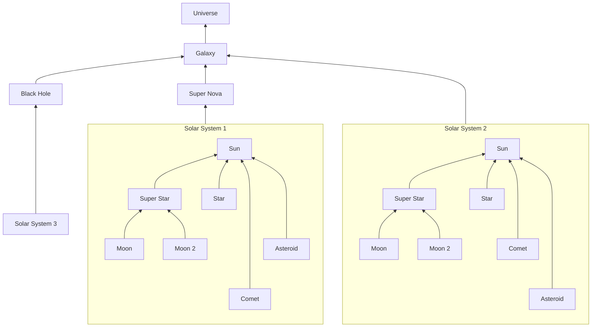
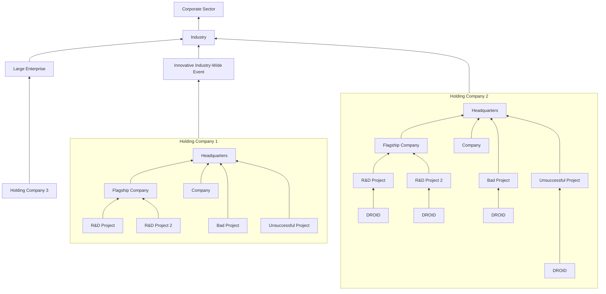

# UBF

The Unified Business Framework (UBF) is a framework for understanding industries, businesses, and their connections from a relational and structural perspective. It aids organizations who consult in Enterprise Resource Planning (ERP) and Mergers and Acquisitions (M&A) in planning large-scale project management. It helps in understanding, predicting, and directing decisions across entire industries and navigating multiple projects and organizations simultaneously. The UBF maps and observes S.T.A.R.s along their due course while aiding them in navigating obstacles in a defined manner. It also has a classification system based on SWARM Intelligence, Agile Methodology, and the DROID Ops (the latest DevOps and MLOps framework) which includes galaxies (businesses covering an entire industry defined by a NAICS code), black holes (largest companies inside the NAICS code), super novas (large events felt across an entire industry), solar systems (companies organized by their holding companies), suns (largest publicly visible company), super stars (flagship or role model company), stars (small company or project), moons (orbital, side project, etc.), comets (unstable projects), and asteroids (same as comets).

---

GALAXY: A business galaxy covers an entire industry, defined by a NAICS Code. A galaxy is a vast network of interconnected companies, organizations, and stakeholders that operate in the same industry, offering similar products or services, and competing for the same customers.

BLACK HOLE: Large Corporation at the center of a galaxy which slowly consumes all its competitors The black hole is identified by the largest companies inside the NAICS Code. At the center of every galaxy is a massive black hole that exerts a powerful gravitational force on everything around it.

SUPER NOVA: A Corporate Cosmic-Shifting event A large event that can be felt across the entire industry.

SOLAR SYSTEM: Companies in a business galaxy are organized by their holding companies, known as the Solar System. These solar systems are classified based on their size, market share, and SIC Codes. 

SUN: The largest publicly visible company inside a solar system or the headquarters of an organization.

SUPER STAR: A flagship or role model company that could one day become a sun. This could also be a fast growing project that is gaining momentum. Super Stars usually require a vast amount of resources and a large budget, yet they also achieve

---

The SUN is the largest publicly visible company inside a solar system or the headquarters of an organization. STARs are small companies or projects defined by S.T.A.R.s. MOONs are orbitals, side projects, start-ups, subsidiaries, or departments identified by their O.R.B.I.T.A.L. Framework. COMETs are unstable projects that need better planning or avoidance. ASTEROIDs are the same as comets. The Unified Business Framework (UBF) uses these components to classify and observe the structure and dynamics of businesses galaxies. The UBF aids organizations in planning large-scale project management and navigating multiple projects and organizations simultaneously, helping them understand, predict, and direct decisions across entire industries. It also helps in making informed decisions about companies, ideas, and investments.

# STAR

---

The S.T.A.R. Guide provides a framework to help understand, track, and assist in the navigation of projects that are part of the Unified Business Framework (UBF). It consists of four components: SPACE, which defines where the project sits inside its business solar system; TRACK, which provides a path through time and space that can be articulated through roadmapping and product journeys; ASSIST, which allows for integration and interaction with the project; and REACH, which summarizes the projected path of the project and the vision of how it will head towards a Super Nova event. The S.T.A.R. Guide helps organizations in planning large-scale project management and navigating multiple projects and organizations simultaneously and provides a framework for understanding, predicting, and directing decisions across entire industries.

